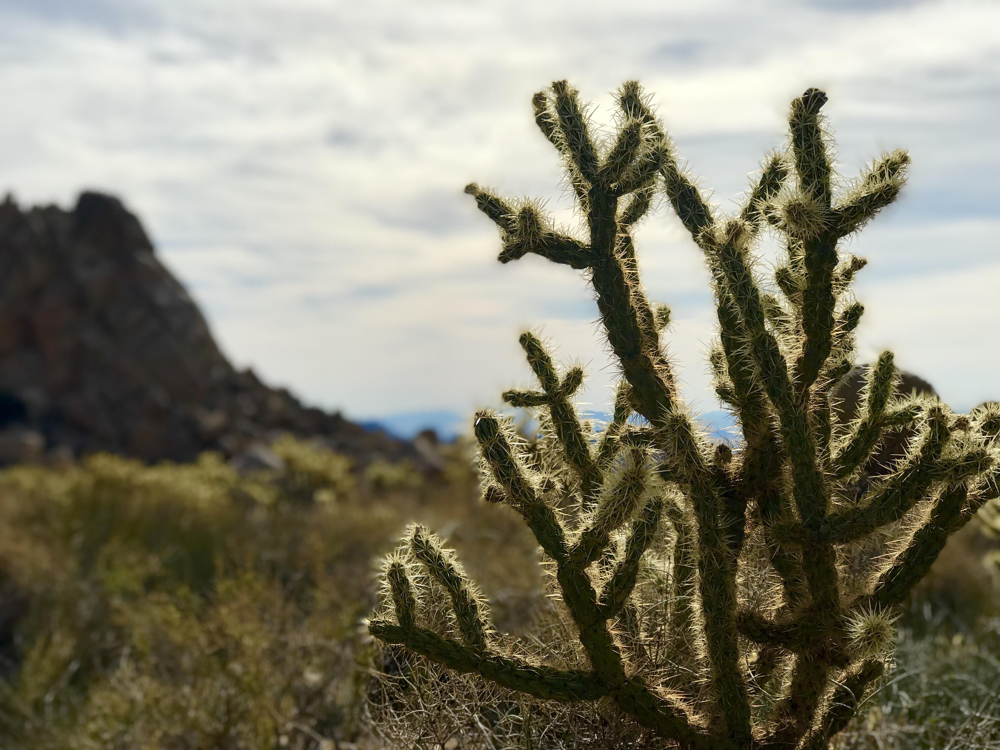
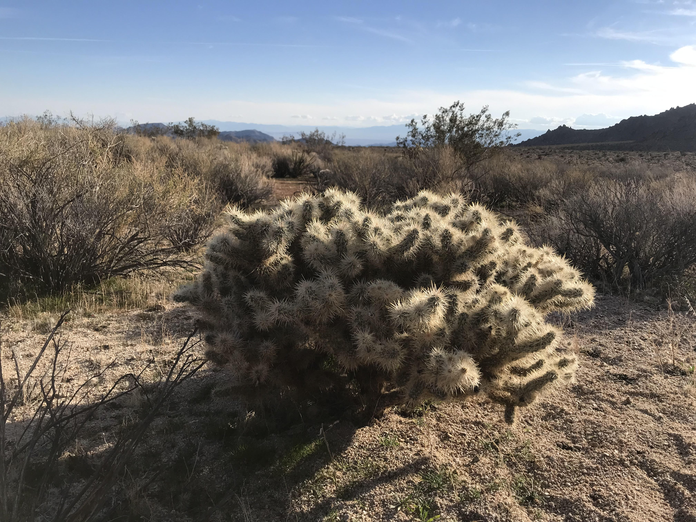
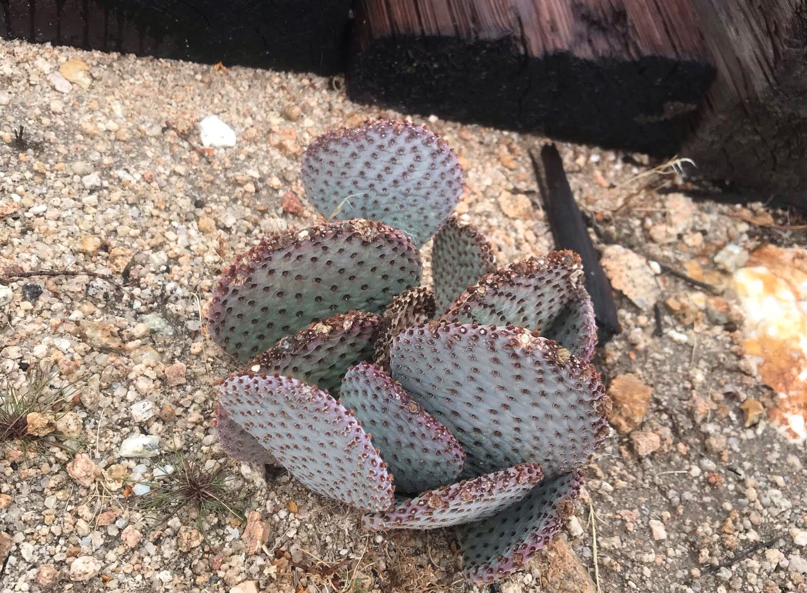
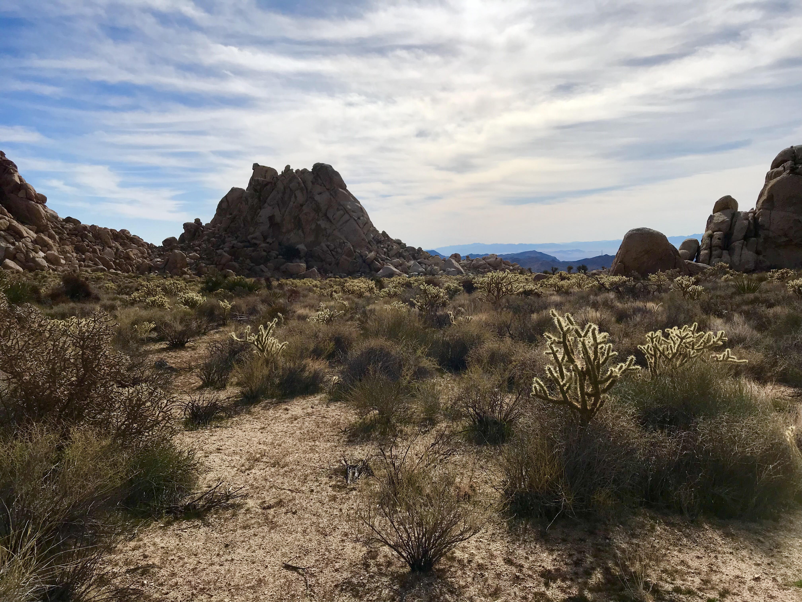

####Let's explore the size, abundance, health, and locals of three different potential study species. 
+ Buckhorn Cholla: *Cylindropuntia acanthocarpa*
+ Silver Cholla: *Cylindropuntia echinocarpa*
+ Beavertail: *Opuntia basilaris*








####How do they measure up? Before any size-binning can be done for the bird double-mutualism experiment, we need to measure a sample of a population of cacti we'll be working from. We'll also need to know which species we even want to work with! Some barriers our study species need to overcome are size, size variability, abundance, and health. After all, we want a tall-ish species (so pollinators and frugivors are interested enough), with plenty of variability in size to test that, and enough of them to manipulate conditions, and healthy enough so we can expect some flowers and fruit later on. And for fun, let's take a quick look at shrubs to see if they're associated with cacti in any respect. 

###Data: What are the cacti?
```{r Setup, include=FALSE, warning = FALSE}

#bring in libraries of interest
library(ggplot2)
library(tidyverse)
library(leaflet)
library(dplyr)


#bring in data
cholla <- read_csv("~/Masters/BCDM_baseline_cactus_survey/baseline_cactus_size_cholla.csv")
opuntia <- read_csv("~/Masters/BCDM_baseline_cactus_survey/baseline_cactus_size_opuntia_basilaris.csv")
buckhorn <- read_csv("~/Masters/BCDM_baseline_cactus_survey/baseline_cactus_size_cylindropuntia_anthrocarpa.csv")
silver <- read_csv("~/Masters/BCDM_baseline_cactus_survey/baseline_cactus_size_cylindropuntia_echinocarpa.csv")
all <- read_csv("~/Masters/BCDM_baseline_cactus_survey/baseline_cactus_size_all.csv")
```


```{r Data, include = TRUE}
head(cholla) #see a bit of the data
head(opuntia) #and for opuntia

```

```{r, echo=FALSE, include=FALSE}
library(ggmap)
register_google(key = "")
``` 


###Location: Where are the cacti?

####Let's map and take a look at the cacti individuals sampled. For *C. acanthocarpa*, we were easily able to sample at every 5 meters along 5 transects that were spaced 5 meters a part (n=105). *C. echinocarpa*, however, was a bit less dense, so after doing our first two transects 5 meters apart, we realized we needed to increase the distance between transects to 10 meters. We also weren't able to get a cactus sampled at every 5 meters, and sampled 9 transects (n=98). The least common, however, was *Opuntia basilaris*, so rare that transects were ineffective and we instead unsystematically searched the entire site only to find a paltry number of individuals (n=26).

```{r Location, warning = FALSE}


map <- leaflet() %>% 
  addTiles() %>% 
  addCircleMarkers(lng = -115.663, lat = 34.783, radius = 5, color = "#F4D99C", popup = "Sunset Cove") %>% #map center point for Sunset Cove
  addCircleMarkers(lng = buckhorn$cactus_lon, lat = buckhorn$cactus_lat, radius = 5, color = "#D5DEAF", popup = "Buckhorn Cholla") %>% #Map buckhorn
  addCircleMarkers(lng = silver$cactus_lon, lat = silver$cactus_lat, radius = 5, color = "#AFCEDE", popup = "Silver Cholla") %>% #map silver
  addCircleMarkers(lng=opuntia$cactus_lon, lat = opuntia$cactus_lat, radius = 5, color = "#DEAFD6") #add opuntia

map #print


library("ggmap")


species <- all$species

cali <- get_map(location = c(lon = -115.662, lat = 34.7825), zoom = 17, color="bw")

sunset <- ggmap(cali)
sunset <- sunset + 
  geom_point(data=all, aes(x=cactus_lon, y=cactus_lat, colour=species, group=species), alpha = 3/10, size = 4) + 
  labs(title = "A", x = "longitude", y = "latitude", color = "Species")
sunset

cali2 <- get_map(location = c(lon = -115.663, lat = 34.7825), zoom = 19, color="bw")

sunset2 <- ggmap(cali2)
sunset2 <- sunset2 + 
  geom_point(data=all, aes(x=cactus_lon, y=cactus_lat, colour=species, group=species), alpha = 3/10, size = 4) + 
  labs(title = "B", x = "longitude", y = "latitude", color = "Species")
sunset2


```

####Click on a point to see the species! (Green is Buckhorn Cholla, blue is Silver Cholla, and pink is Beavertail.)

####We were able to sample 98 Silver Cholla (*C. enchinocharpa*) and 105 Buckhorn Cholla (*C. acanthocarpa*), but had to do nearly twice as many transects for the former (9 versus 5 transects). You can see the differences in densities for the two cholla species in the map above. However, we had to abandon the transect method and search haphazardly to find any Beavertail (*Opuntia basilaris*) at all. *C. acanthocarpa* is the densest cactus species at Sunset Cove, followed by *C. echinocarpa* and then *O. basilaris*. Based on my proposed protocol, each study species needs 150 individuals to replicate each combination of variables 10 times. Ideally, the individuals manipulated between flowering and fruiting season will not be resampled in the the fruiting season, as our manipulation of the flowers in April may impact the number of fruit in August. This means that *C. acanthocarpa* is a solid study species option, *C. echinocarpa* is certainly possible, but not as dominant as its cousin, and *O. basilaris* is out of the question. 

###Size of the cacti

####We've seen the distribution of cacti, but size of the cacti is what's really important for this study. We need to know if the sizes are variable enough to split into 3 class sizes (small, medium, and large), and have a general idea of their overal height, to consider if pollinating and frugivorous birds will engage with the flower and fruits of the cacti at all. 

```{r Size Plot, warning = FALSE}
tapply(all$z, all$species, mean) #means height of each species

ggplot(all, aes(x = species, y=z)) +
  geom_boxplot() + labs(x = "Species", y = "Height in meters") +
  theme_minimal(base_size = 22)  #no outliers

```

```{r Size Kruskall Wallis test, warning = FALSE}
#Test for statistical difference between species
shapiro.test(buckhorn$z) #nearly normal
shapiro.test(silver$z) #not normal
shapiro.test(opuntia$z) #normal

#Because not everything is normal, let's do a non parametric version of ANOVA: Kruskall Wallis to test height of cacti 
kruskal.test(species ~ z, data = all)
#p < 0.0001, each cactus species has non-indentical heights. 


```
###Variability for binning

####One important variable of my project is size classes within a species: small, medium, and large. Because height is what may influence pollination and frugivory, I will use the "z-axis" that I measured as the factor for size. 

####Each size class must have enough individuals within it to replicate. I need to decide how to bin the size classes; either I must use natural breaks present in the data, or I must create equally-sized bins for the study species. Let's examine each species size distribution, and make decisions about size class breaks upon that.

```{r Size Class Exploration, warning = FALSE}
#Buckhorn Cholla size distribution
ggplot(buckhorn, aes(x = z)) +
  geom_density() + labs(title = "Size of Cacti: Buckhorn", x = "Height", y = "Cacti") +
  theme_minimal() #bimodal, ever so slightly
ggplot(silver, aes(x = z)) +
  geom_density() + labs(title = "Size of Cacti: Silver", x = "Height", y = "Cacti") +
  theme_minimal() #unimodal
ggplot(opuntia, aes(x = z)) +
  geom_density() + labs(title = "Size of Cacti: Beavertail", x = "Height", y = "Cacti") +
  theme_minimal()


```

####None of the species have distributions with natural breaks (see density plots), and, especially for our two Cylindropuntia species, we can see that there are even distances between quartiles (see boxplots). For these reasons, I propose an equal-size binning method to determine size class. 

####But what exactly are the size classes then, for each species?
```{r Size Class Determination, warning = FALSE}
#Determine equal-sized size classes for cacti based on height (z)
minmax <- data.frame(
aggregate(z~species, data=all, min),
aggregate(z~species, data=all, max)) #create dataframe with min and max

bins <- mutate(minmax, range = z.1-z)
bins <- mutate(bins, bins = range/3) #divide by 3 (because 3 size classes wanted, small medium and large) to get differences between size classes

size_class_options <- mutate(bins, small = z) %>% 
  mutate(bins, medium = z + bins) %>% 
  mutate(bins, large = z.1 - bins) #create our size classes, each column represents the minimum value to start each size class. 


#Make it pretty
#create vectors
species <- c("Cylindropuntia acanthocarpa", "Cylindropuntia echinocarpa", "Opuntia basilaris")
small <- c("<85cm", "<45cm", "<15cm")
medium <- c("86cm - 152cm", "46cm - 72cm", "16cm - 22cm")
large <- c(">153cm", ">73cm", ">23cm")
#create dataframe for easy viewing
size_class <- data.frame(species, small, medium, large)
size_class

#Let's quickly visualize the size bins
ggplot(size_class_options, aes(x = species, y=bins)) +
  geom_bar(stat = "identity") + labs(title = "Size of Bins", x = "Species", y = "Bins size (meters)") +
  theme_minimal()


```

####We’ve determined what our size classes would be for each species, and can see that Buckhorn Cholla (*C. acanthocarpa) has the largest class sizes, followed by Silver Cholla, and then Beavertail. Having large size classes may translate more clearly to birds, and therefore, be a suitable metric to measure if bird visitation is influenced by cactus size.

###Health of the cacti

####Another important factor to consider when exploring potential study species is their overall health. After all, are these individuals even capable of flowering and fruiting? To measure health, we created a health index based on the Wind Wolves Bakersfield Cactus Report, which classifies each individual's health on a discrete scale of 1-5 (1 being the least healthy, and 5 being the healthiest). We considered overall paddle/branch death, as well as scarification and rot when determining health. 

```{r Health, warning = FALSE}
#What is the distribution of health index scores?

ggplot(all, aes(x = health_index)) +
  geom_histogram() + labs(title = "Number of individuals in each health class", x = "Health of Species", y = "Health class") +
  facet_grid(~species) +
  theme_minimal(base_size=25)

```

```{r Health statistics, warning=FALSE}


myFreqs <- all %>% 
  group_by(health_index, species) %>%
  summarise(Freq = n())
myFreqs #get counts into dataframe
chi <- spread(myFreqs, health_index, Freq) #make it matrix
chi$'<NA>' = NULL #extra column
chi <- chi[-c(4), ] #extra row
chi<- chi %>% column_to_rownames(var="species") #compatable with chi. Without this, species names are not numeric and mess up calculation
chi

chisq <- chisq.test(chi) #chi-square independence test
chisq #statistically different


```


####We can see that the Cylindropuntia species are the healthier than the Opuntia counterparts. The question is, will an unhealthy population still flower/fruit as much as a healthy population? Perhaps, but this is not the question of my project. 

###Conclusions: Who is America's Next Top Cactus?



####Considering the abundance, the density, the health, and size class options, Opuntia basilaris is not a realistic contender as a study species. It is likely to be overlooked by birds, not bloom/fruit due to health, and is in small supply. Therefore, I must remove it from the running.

####Both of Cylindropuntias are healthy. Silver Cholla, however, is still less dominant than Buckhorn Cholla, is smaller overall, and doesn't have the width of size classes that Buckhorn Cholla does. While these traits do not mean the Silver Cholla could not be viable study species, I propose that focusing more deeply on Buckhorn Cholla and deepening the methods of observation (i.e., joy sampling: stationary versus mobile count data, and increased hours of focal observation) will be more beneficial to answering my study questions than a comparitive study between cacti species would.


